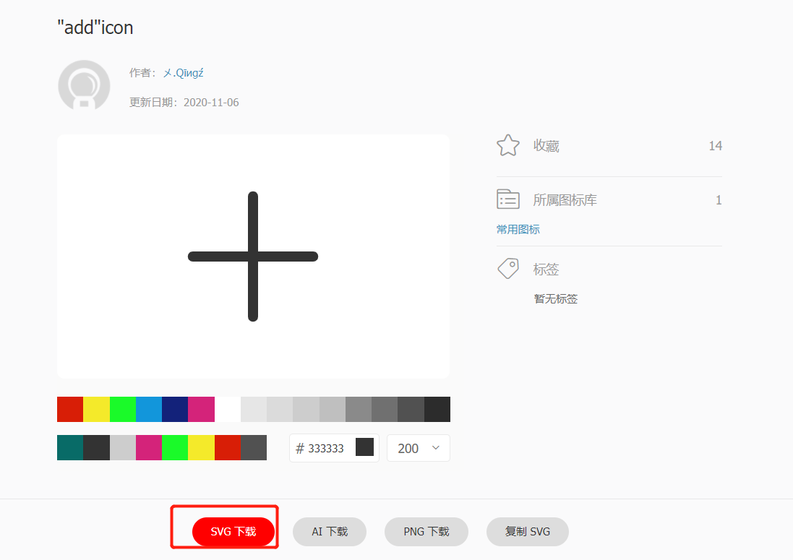

# 在vue中使用svg图标

在后台管理项目等兼容性要求不高的项目中可使用此方案，便于维护。

- vue-cli + `svg-sprite-loader`
- iconfont font class方式

## vue-cli + `svg-sprite-loader`

### 安装依赖

```shell
npm i svg-sprite-loader -D
```

### 下载图标

在iconfont网站选取图标下载，存入src/icons/svg 中



### 修改规则和新增规则

修改规则和新增规则，对src/icons目录单独使用svg-sprite-loader处理，vue.config.js 

```js
// resolve定义一个绝对路径获取函数
const path = require('path')

function resolve(dir) {
    return path.join(__dirname, dir)
}
module.exports = {
    chainWebpack(config) {
        // 配置svg规则排除icons目录中svg文件处理
        // 目标给svg规则增加一个排除选项exclude:['path/to/icon']
        config.module.rule("svg")
            .exclude.add(resolve("src/icons"))
        // 新增icons规则，设置svg-sprite-loader处理icons目录中的svg
        config.module.rule('icons')
            .test(/\.svg$/)
            .include.add(resolve('./src/icons')).end()
            .use('svg-sprite-loader')
            .loader('svg-sprite-loader')
            .options({
                symbolId: 'icon-[name]'
            })
    }
}
```

### 创建SvgIcon组件

创建SvgIcon组件，src/components/SvgIcon.vue 

```vue
<template>
  <svg :class="svgClass" aria-hidden="true" v-on="$listeners">
    <use :xlink:href="iconName" />
  </svg>
</template>

<script>
export default {
  name: 'SvgIcon',
  props: {
    iconClass: {
      type: String,
      required: true
    },
    className: {
      type: String,
      default: ''
    }
  },
  computed: {
    iconName () {
      return `#icon-${this.iconClass}`
    },
    svgClass () {
      if (this.className) {
        return 'svg-icon ' + this.className
      } else {
        return 'svg-icon'
      }
    }
  }
}
</script>

<style lang="scss" scoped>
.svg-icon {
  width: 1em;
  height: 1em;
  vertical-align: -0.15em;
  fill: currentColor;
  overflow: hidden;
}
</style>
```

### 图标自动导入

自动导入svg并全局注册SvgIcon组件，src/icons/index.js

```js
import Vue from 'vue'
import SvgIcon from '@/components/SvgIcon.vue'
// 全局引入 SvgIcon 组件
Vue.component('svg-icon', SvgIcon)
const req = require.context('./svg', true, /\.svg$/) // true 遍历子目录
req.keys().map(req);
```

### 在组件中使用 SvgIcon 组件

在组件中使用 SvgIcon 组件，App.vue 

```vue
<template>
    <div id="app">
        <div id="nav">
            <router-link to="/">Home</router-link> |
            <router-link to="/about">About</router-link>

            <div class="red-theme">
                <p>红色主题<svg-icon icon-class="file-code"></svg-icon></p>
                嵌套<svg-icon icon-class="resource"></svg-icon>
            </div>

            <div class="blue-theme">
                <p>蓝色主题<svg-icon icon-class="add"></svg-icon></p>
            </div>
        </div>

        <router-view />
    </div>
</template>

<style lang="scss">
.red-theme {
  color: red;
  font-size: 20px;
}
.blue-theme {
  color: blue;
  font-size: 20px;
}
</style>
```

## iconfont font class方式

在vue中引用iconfont中的图标完整教程（两种方式）：直接引用和在data中存放（Font class方式）https://blog.csdn.net/qq_36485978/article/details/107152115